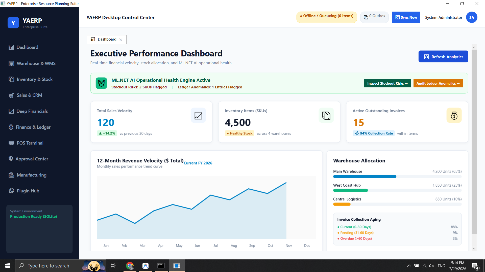
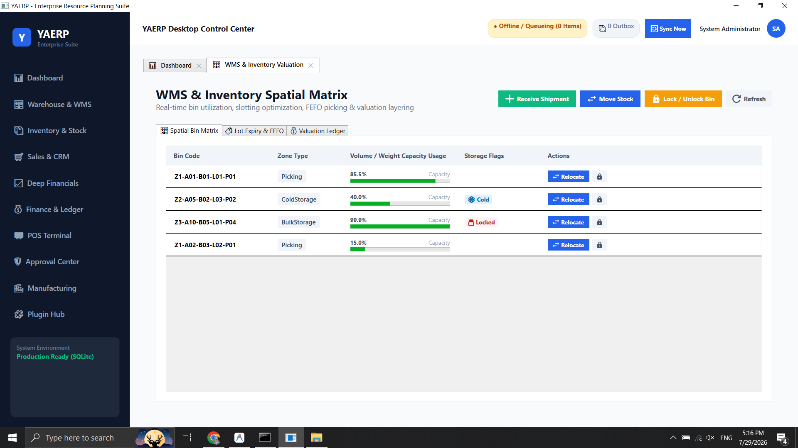
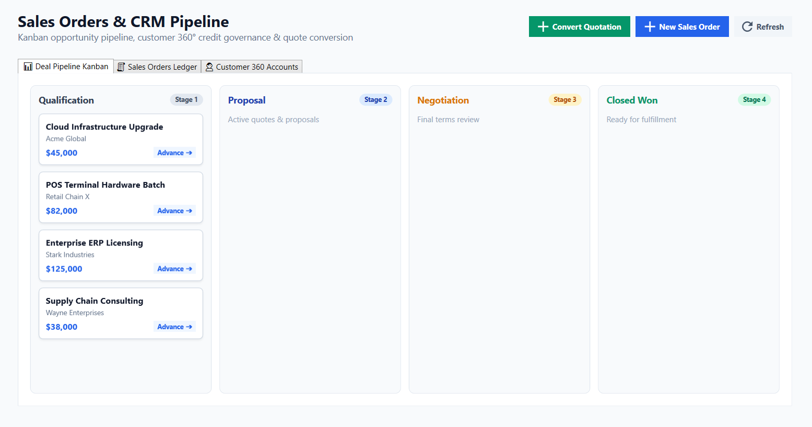
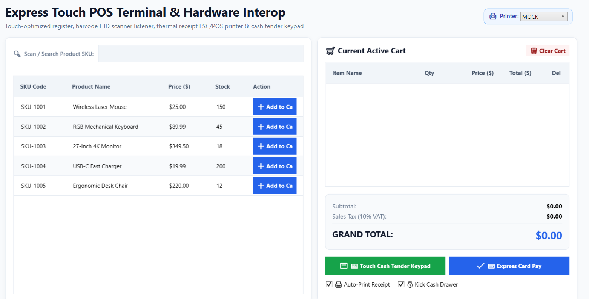
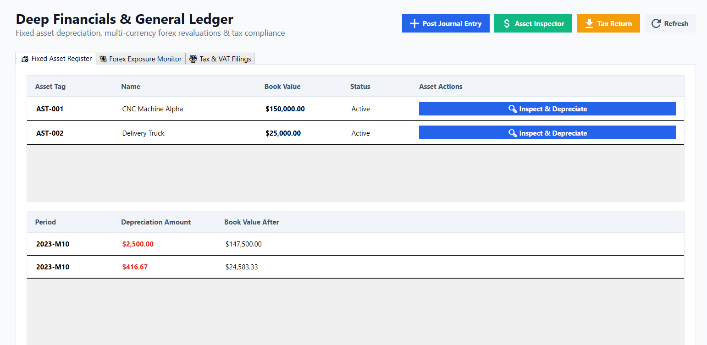
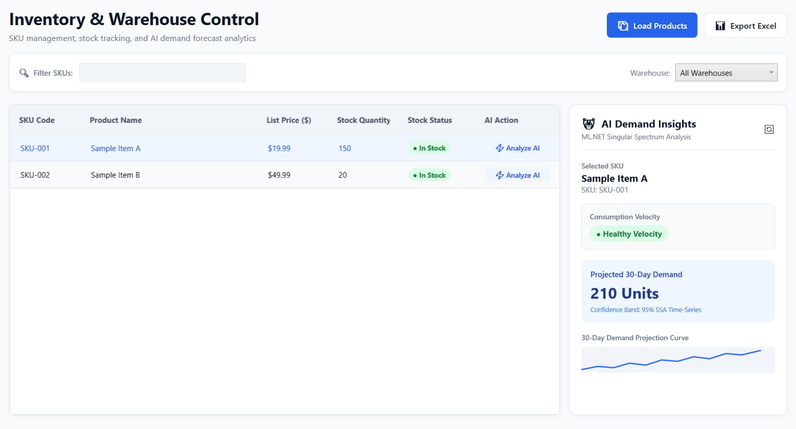
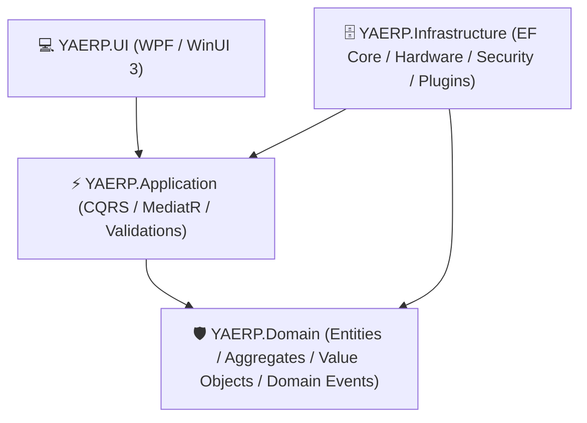
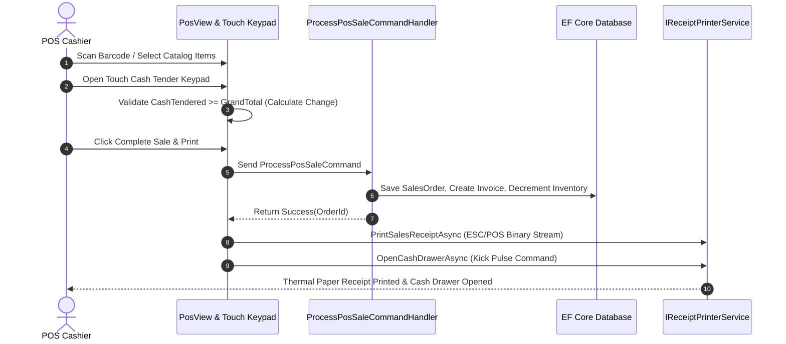

# ⚡ YAERP — Yet Another Enterprise Resource Planning
> **Author & System Architect:** Ratul  
> **Tech Stack:** C# 12 | .NET 8 / .NET 9 | WinUI 3 / WPF | Entity Framework Core | Dapper | PostgreSQL / SQL Server / SQLite  
> **Architectural Pattern:** Clean Architecture | Domain-Driven Design (DDD) | CQRS | MVVM  

---

<p align="center">
  <a href="#-executive-summary--vision">Executive Summary</a> •
  <a href="#-visual-showcase--ui-gallery">UI Showcase</a> •
  <a href="#-architectural-blueprint--layer-boundaries">Architecture</a> •
  <a href="#-complete-erp-module-specification">Modules</a> •
  <a href="#-hardware-interop--edge-capabilities">Hardware & POS</a> •
  <a href="#-security-rbac--multi-tenancy">Security</a> •
  <a href="#-testing--quality-assurance">Testing</a> •
  <a href="#-getting-started--quickstart">Quickstart</a>
</p>

---

## 🚀 Executive Summary & Vision

**YAERP** is an enterprise-grade, high-performance, modular ERP suite designed natively for Windows desktop environments. Built to rival top-tier commercial ERP platforms, YAERP delivers sub-second query response times, robust offline resilience, multi-tenant database isolation, and transactional integrity across all operational business modules.

### Mission Highlights
- **Sub-Second Execution**: Ultra-fast CQRS read/write pipelines utilizing Dapper for high-speed reporting grids and EF Core for complex domain entity tracking.
- **Desktop Native Power**: Modern Windows MVVM architecture with zero code-behind logic, full data virtualization, hardware integration, and rich UI/UX animations.
- **Isolated Plugin Ecosystem**: Dynamic assembly loading using collectible `AssemblyLoadContext` sandboxes for zero-downtime extensibility.
- **Enterprise Financial & Inventory Governance**: Multi-level approval state machines, DAG cycle-detected BOM explosions, double-entry ledger enforcement, and automatic audit trailing.

---

## 📸 Visual Showcase & UI Gallery

| Executive Command Dashboard | Enterprise Warehouse Management System (WMS) |
| :---: | :---: |
|  |  |
| *Real-time KPI metrics, stock telemetry, sales velocity, and executive insights.* | *Interactive visual bin grid, capacity heatmaps, slotting optimization, and stock transfers.* |

| Sales & Interactive CRM Kanban Pipeline | Express Touch POS Terminal Workspace |
| :---: | :---: |
|  |  |
| *Drag-and-drop deal pipeline, quotation converter, and Customer 360° credit governance.* | *Touch-optimized catalog, barcode HID listener, cash tender keypad, and ESC/POS printer interop.* |

| Deep Financials & Fixed Asset Register | Inventory & Multi-Category Stock Matrix |
| :---: | :---: |
|  |  |
| *Real-time balanced journal voucher enforcement, fixed asset depreciation, and VAT returns.* | *Multi-warehouse stock valuation, reorder thresholds, and lot/batch batch tracking.* |

---

## 🏛️ Architectural Blueprint & Layer Boundaries

YAERP strictly enforces **Clean Architecture** principles layered on top of **Domain-Driven Design (DDD)** concepts. Dependency flow moves strictly inward towards the pure `Domain` core.



### Layer Responsibilities

```text
d:\YGGDSL\
├── src\
│   ├── YAERP.Domain\            # Pure Domain Models, Value Objects, Domain Events (Zero Framework Dependencies)
│   ├── YAERP.Application\       # CQRS Handlers (MediatR), DTOs, FluentValidators, Interface Abstractions
│   ├── YAERP.Infrastructure\    # EF Core DbContext, PostgreSQL/SQLite Migrations, Hardware Interop, Security, Plugins
│   └── YAERP.UI\                # WPF Presentation Layer, Modern Views, ViewModels, Drawers, Modals, Converters
└── tests\
    ├── YAERP.Domain.Tests\       # Unit tests for Domain Entities, State Mutations, and Business Invariants
    ├── YAERP.Application.Tests\  # Handler tests, CQRS Pipelines, In-Memory Validation Tests
    ├── YAERP.Infrastructure.Tests\ # Persistence, Sync Engine, Security, and Hardware Interop Tests
    ├── YAERP.UI.Tests\           # ViewModel logic tests, Command bindings, Converter tests
    └── YAERP.Architecture.Tests\ # NetArchTest Layer Boundary & Dependency Enforcement Tests
```

1. **`YAERP.Domain`**:
   - Holds strongly-typed identifiers (e.g., `CustomerId`, `ProductId`, `WarehouseId`, `TenantId`).
   - Contains pure domain entity logic, Value Objects, Domain Events, and custom Domain Exceptions.
   - **Zero external framework dependencies** (no EF Core, no UI, no JSON libraries).
2. **`YAERP.Application`**:
   - Implements CQRS (Commands for write operations, Queries for un-tracked high-speed reads).
   - MediatR pipeline behaviors for validation, logging, and transaction scoping.
   - Decoupled interface definitions (`IApplicationDbContext`, `ITenantContext`, `IReceiptPrinterService`).
3. **`YAERP.Infrastructure`**:
   - EF Core DbContext with Global Query Filters automatically isolating multi-tenant data.
   - ESC/POS thermal receipt printing, cash drawer kick pulse hardware drivers, barcode HID listeners.
   - Isolated collectible `AssemblyLoadContext` plugin sandbox engine.
4. **`YAERP.UI`**:
   - MVVM architecture powered by `CommunityToolkit.Mvvm`.
   - Centralized Vector SVG geometry system (`VectorIcons.xaml` & `SvgIcon` control).
   - Integrated slide-out `DrawerHost` and centered `ModalOverlayHost` overlay architecture.
   - **Zero business logic in `.xaml.cs` (Code-Behind)**.

---

## 📦 Complete ERP Module Specification

YAERP is built as a modular enterprise platform supporting all critical business operations:

| Module | Core Responsibilities & Key Capabilities |
| :--- | :--- |
| **Identity & Security (IAM)** | User management, RBAC role-based access control, field-level encryption, security audit logs, multi-tenant isolation. |
| **Inventory & WMS** | Multi-warehouse stock tracking, dynamic bin slotting optimization, capacity weight/volume heatmaps, lot/batch tracking, stock relocation drawers. |
| **Sales & CRM** | Deal pipeline Kanban board, quotation-to-sales-order conversion, Customer 360° credit limit governance, margin warning flags (<20%). |
| **Financials & General Ledger** | Double-entry bookkeeping, real-time balanced journal voucher enforcement (`Sum(Debits) == Sum(Credits)`), fixed asset depreciation schedules, regional VAT/Tax filings. |
| **Express Touch POS** | Touch-optimized product catalog, numeric keypad cash tender modal, real-time change due calculator, ESC/POS hardware receipt printer & cash drawer kick interop. |
| **Manufacturing & MRP II** | Hierarchical multi-level BOM TreeView, BOM builder with Directed Acyclic Graph (DAG) cycle detection, shop floor production output logging, MRP demand explosion matrix. |
| **Multi-Level Approvals** | Tiered approval authorization workflow (Tier 1 Supervisor → Tier 2 Finance Manager → Tier 3 Director), mandatory rejection comment modals, document inspector drawers. |
| **Dynamic Plugin Engine** | Collectible `AssemblyLoadContext` runtime loader for C# plugin `.dll` files, live Serilog log streamer drawer. |

---

## 🔌 Hardware Interop & Edge POS Capabilities

YAERP includes native hardware drivers designed for retail and logistics environments:



---

## 🔐 Security, RBAC & Multi-Tenancy

1. **Row-Level Multi-Tenant Isolation**:
   - `DbContext` automatically applies global query filters based on `ITenantContext`. Data cross-contamination between tenants is impossible at the database query level.
2. **Immutable Security Audit Trail**:
   - `AuditSaveInterceptor` automatically captures every Create, Update, and Delete operation, storing:
     - `UserId`, `TenantId`, `TimestampUtc`, `EntityName`, `ActionType`, `OldValues (JSON)`, `NewValues (JSON)`.
3. **Field-Level Security & UI RBAC**:
   - Custom `PermissionVisibilityConverter` dynamically shows or hides UI controls and action buttons based on logged-in user permissions.

---

## 🧪 Testing & Quality Assurance Architecture

YAERP enforces automated quality checks before any build is eligible for deployment:

```bash
Passed!  - Failed:     0, Passed:    15 - YAERP.Domain.Tests.dll
Passed!  - Failed:     0, Passed:    24 - YAERP.Application.Tests.dll
Passed!  - Failed:     0, Passed:    36 - YAERP.Infrastructure.Tests.dll
Passed!  - Failed:     0, Passed:     3 - YAERP.Architecture.Tests.dll
Passed!  - Failed:     0, Passed:    41 - YAERP.UI.Tests.dll
----------------------------------------------------------------------
Total: 119 Passed, 0 Failed, 0 Skipped (100% Pass Rate)
```

- **Architecture Tests (`NetArchTest`)**: Automatically verifies layer dependencies (e.g. Domain layer never references Infrastructure or UI).
- **Validation Tests**: Verifies unbalanced journal entries are blocked, BOM cycle detection catches circular dependencies, and credit line violations trigger alerts.

---

## 🛠️ Getting Started & Quickstart

### Prerequisites
- [.NET 8.0 SDK](https://dotnet.microsoft.com/download/dotnet/8.0) or [.NET 9.0 SDK](https://dotnet.microsoft.com/download/dotnet/9.0)
- Windows 10 / Windows 11 / Windows Server 2019+ (x64 or ARM64)
- PostgreSQL (Optional; falls back seamlessly to SQLite `yaerp_local.db` if connection string is omitted).

### 1. Clone the Repository
```bash
git clone https://github.com/yaratul2005/YAERP-by-Ratul.git
cd YAERP-by-Ratul
```

### 2. Build the Solution
Compilation enforces zero warnings (`<TreatWarningsAsErrors>true</TreatWarningsAsErrors>`):
```bash
dotnet build YAERP.slnx -c Release
```

### 3. Run the Test Suite
Execute all 119 unit and integration tests across solution projects:
```bash
dotnet test YAERP.slnx
```

### 4. Launch the Desktop Application
```bash
dotnet run --project src/YAERP.UI/YAERP.UI.csproj
```

*Note: On first execution, `IDatabaseSeeder` automatically initializes tenant contexts, system admin accounts, default chart of accounts, and base inventory units of measure.*

---

## 🚀 Downloading & Self-Contained Installation

To deploy YAERP on production Windows workstations without pre-installing the .NET SDK:

1. Navigate to the **[Releases](https://github.com/yaratul2005/YAERP-by-Ratul/releases)** section of this repository.
2. Download the latest `YAERP-v1.0-win-x64.zip` release package.
3. Extract the ZIP archive to your preferred installation directory (e.g., `C:\Program Files\YAERP\`).
4. Launch `YAERP.UI.exe`. The application runs completely self-contained!

---

## 📄 License & Attribution

Designed, Architected, and Engineered by **Ratul** — System Architect & Lead Developer of **YAERP**.

*Copyright © 2026 Ratul. All rights reserved.*
